# Market Communication — Flow & Visualization Pack

## 1. Master Flow

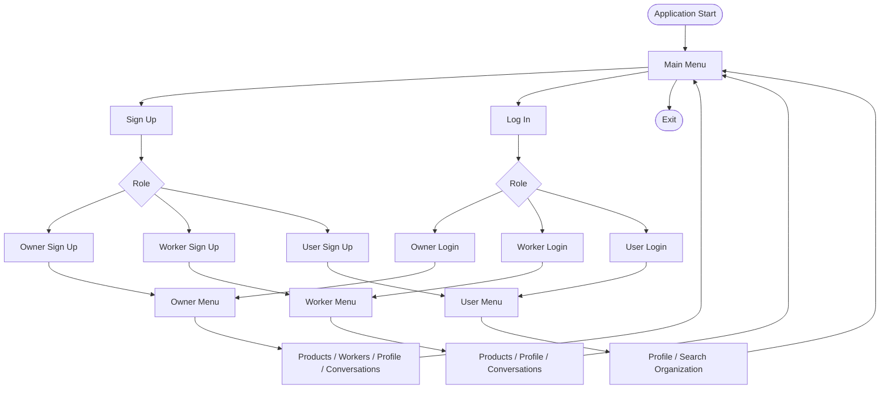

## 2. Owner Product Lifecycle

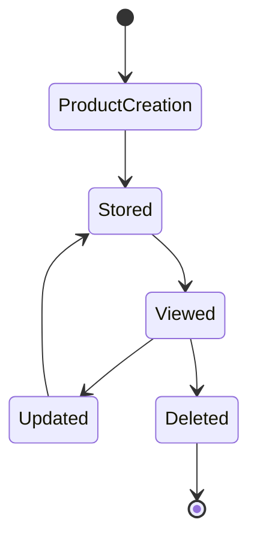

## 3. Account Creation

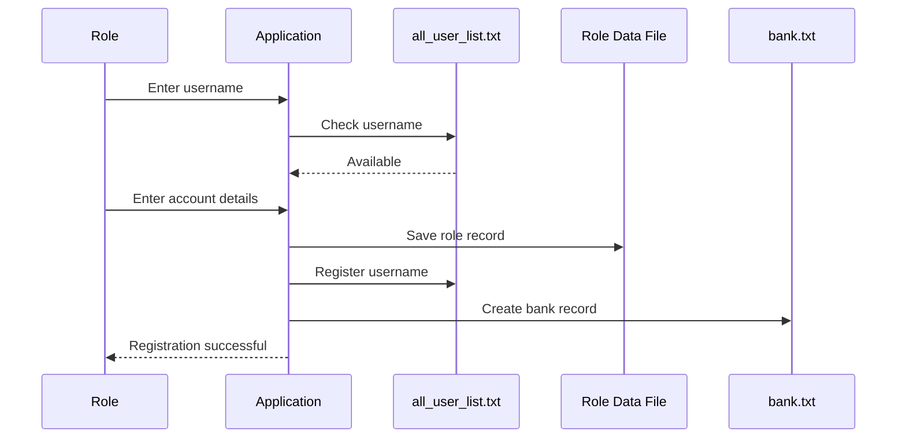

## 4. Owner Registration

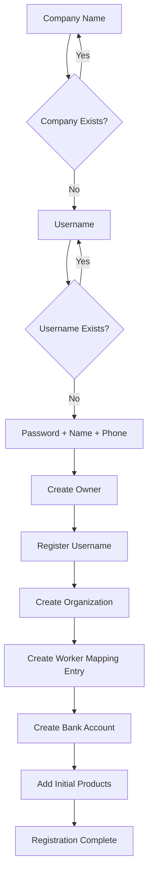

## 5. Worker Registration

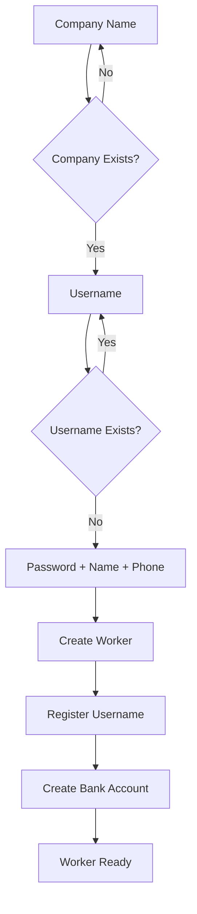

## 6. User Registration

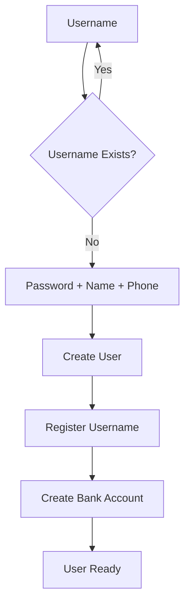

## 7. Organization Relationship

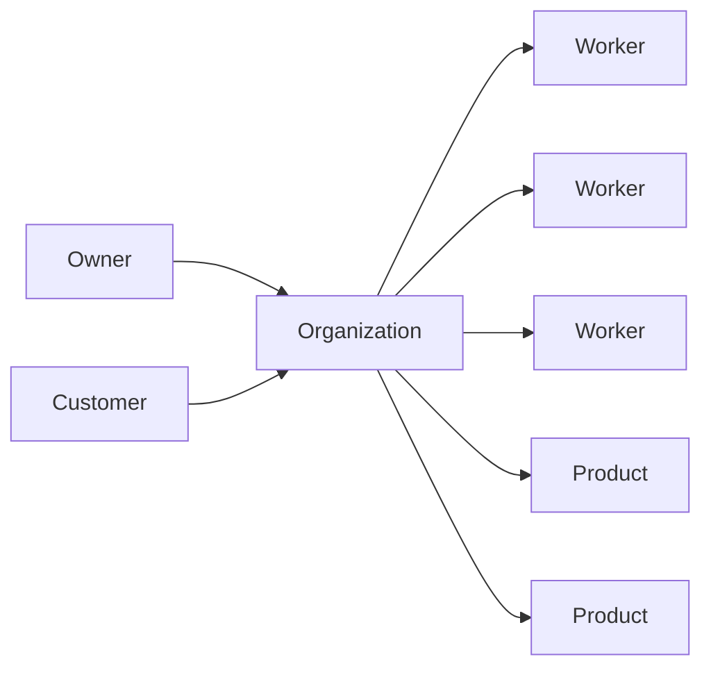

## 8. Communication Topology

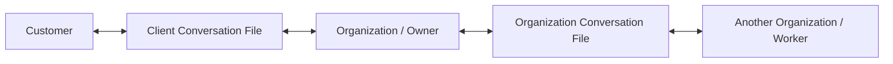

## 9. Data Storage Map

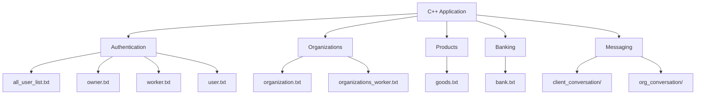

## 10. Purchase-Oriented Flow

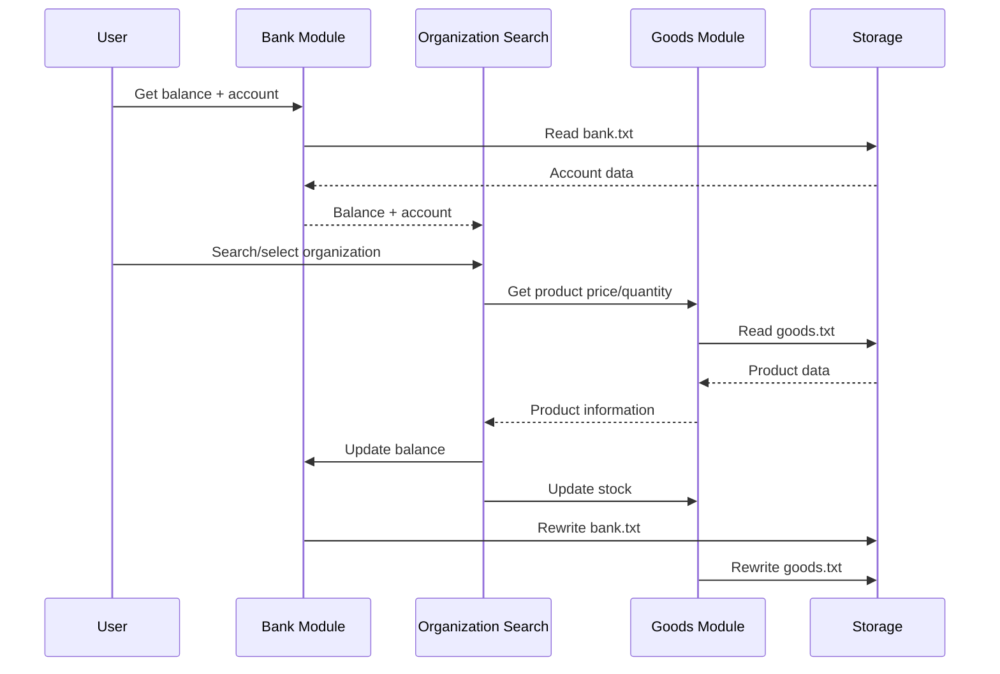

## 11. Return-to-Menu Pattern

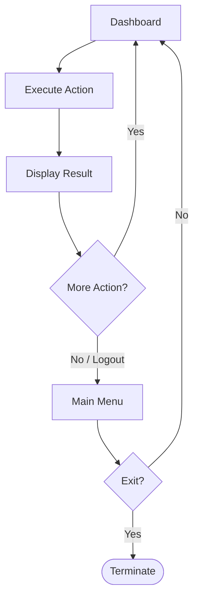

## 12. Conceptual Modern Architecture

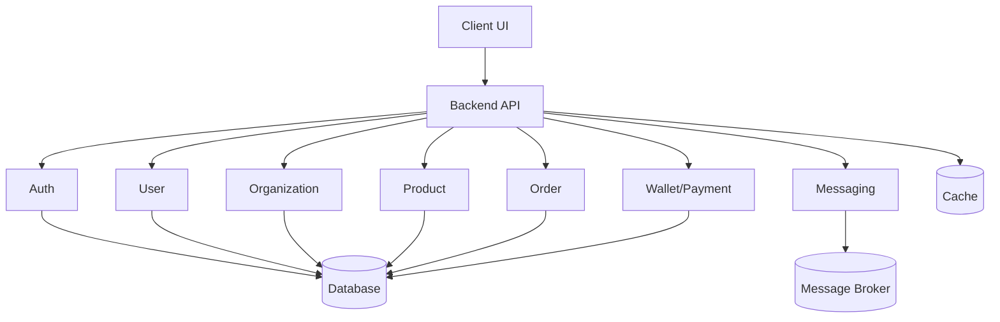
