# Market Communication — Project Documentation

> Repository: https://github.com/Fizzz083/Market-Communication  
> Current repository state reviewed: `master`, public repository, 2 commits.

## 1. Project Overview

**Market Communication** is a C++ console-based marketplace/communication application branded in the source code as **BUSYness PANDA**.

The application models three kinds of users:

- **Owner** — owns an organization, manages products and workers, maintains a bank account, and communicates with customers or other organizations.
- **Worker** — belongs to an organization, can view company products, maintain a bank account/profile, and communicate with the organization or customers.
- **User/Customer** — maintains a profile and bank account, searches organizations, views/selects products through the organization search/purchase flow, and communicates with organizations.

The implementation is a small educational/project-style C++ application using local text files as its persistence layer.

## 2. Core Capabilities

### Authentication and account creation

The main menu provides:

1. Sign Up
2. Log In
3. Exit

Sign-up is split into:

- Owner sign-up
- Worker sign-up
- User sign-up

Each account records a username, password, name, and phone number. Owner and worker accounts also associate the account with an organization.

The code checks the global username list before creating a new account.

### Owner capabilities

After owner login, the menu provides:

- My Profile
- My Products
- My Workers
- Add Product
- Edit Product Information
  - Update Product
  - Delete Product
- Organization Conversation
- Open Conversation
- Log Out

Owner registration also creates/initializes organization-related records, a bank account, and initial products.

### Worker capabilities

After worker login:

- My Profile
- My Company's Products
- Organization Conversation
- Open Conversation
- Log Out

Workers are linked to an existing organization during registration.

### Customer/User capabilities

After user login:

- My Profile
- Search Organization
- Log Out

The organization-search path obtains the customer's bank balance/account information and passes it to the organization search/purchase workflow.

### Product management

Products contain:

- Product name
- Price
- Quantity

Owners can:

- Add multiple products
- Display organization products
- Update a product's price and quantity
- Delete a product

Product records are stored in `goods.txt`.

### Bank/account simulation

The application contains a simple bank-account abstraction.

Supported operations include:

- Open bank account
- Store bank account number
- Store account balance
- Display account information
- Retrieve balance for a user
- Update a balance
- Resolve an organization owner's account

This is a local simulation rather than an integration with a real banking system.

### Organization management

Organizations contain:

- Organization name
- Owner
- Associated workers
- Products

The application checks organization names for uniqueness/existence and maintains organization-to-worker relationships.

### Communication

There are two communication directions:

1. **Customer ↔ Organization**
2. **Organization ↔ Organization**

Messages are persisted in local files under conversation directories.

The conversation module supports:

- Sending a message
- Reading previous messages
- Replying from the relevant user role

## 3. Main Technologies

| Area | Technology / Approach |
|---|---|
| Language | C++ |
| Application type | Console / terminal application |
| Standard library | C++ STL |
| Headers | `bits/stdc++.h` plus project headers |
| Persistence | Plain-text files |
| Data parsing | `fstream`, `stringstream`, vectors/maps |
| Main architecture | Procedural menu + object-oriented classes |
| Build/project artifacts | Code::Blocks project files are present |
| Networking | None identified |
| External database | None |
| External API | None |
| GUI | None |
| Authentication service | None; local file comparison |
| Messaging transport | None; local file storage |

The repository itself describes the application as a **“c++ console application.”**

## 4. High-Level Architecture

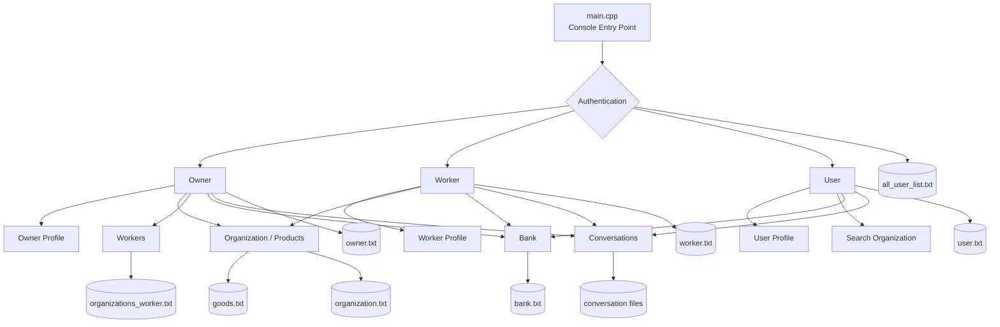

## 5. Repository Structure

```text
Market-Communication/
├── main.cpp
├── Bank.H
├── Owner.H
├── worker.h
├── user.h
├── organization.h
├── conversation.h
│
├── all_user_list.txt
├── bank.txt
├── goods.txt
├── organization.txt
├── organizations_worker.txt
├── owner.txt
├── user.txt
├── worker.txt
│
├── conversation/
├── client_conversation/
├── org_conversation/
│
├── Project_my.cbp
├── Project_my.depend
├── Project_my.layout
├── Proect_my.layout
│
├── bin/Debug/
└── obj/Debug/
```

## 6. Important Design Characteristics

### File-based persistence

Instead of a relational or document database, the program reads and rewrites `.txt` files.

Typical records are written with a simple `new` marker followed by space-separated values.

Example conceptual record:

```text
new username password full_name phone
```

Product records follow a compact organization/product representation:

```text
new organization product price quantity product price quantity ...
```

### Object-oriented model

Important classes include:

- `bank`
- `goods`
- `organization`
- `conversation`
- `owner`
- `worker`
- `user`

There is also inheritance between several of these components.

For example, the owner class inherits from:

```text
bank
organization
conversation
```

This gives the owner access to financial, product/organization, and communication behavior.

## 7. User Journey

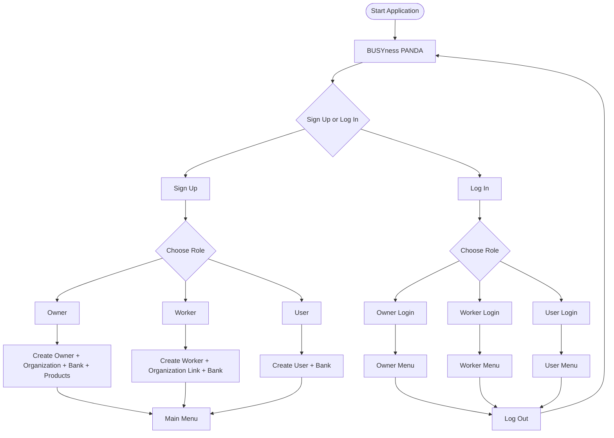

## 8. Owner Flow

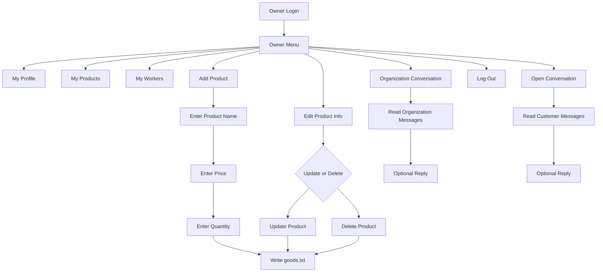

## 9. Worker Flow

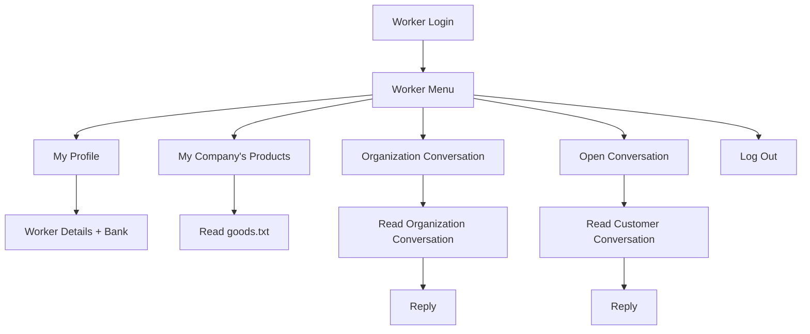

## 10. Customer Flow

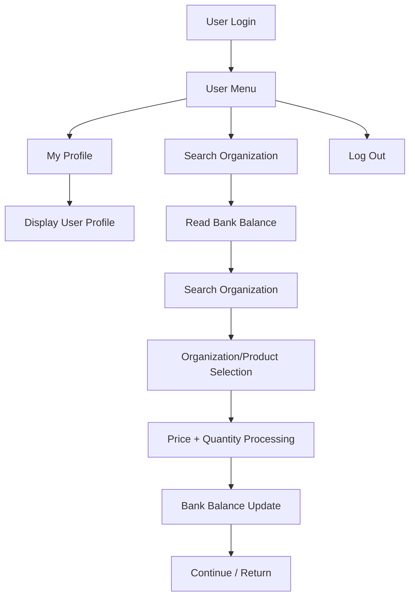

## 11. Communication Flow

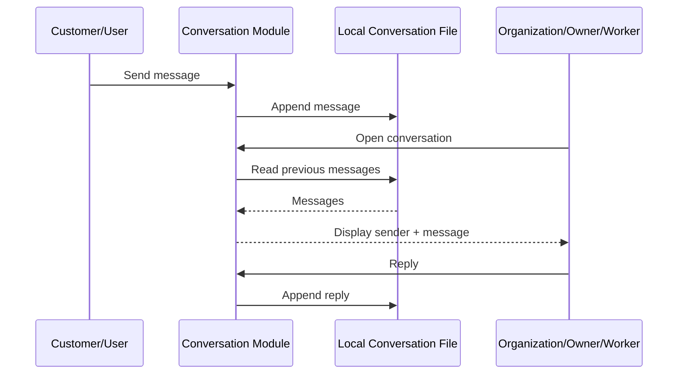

## 12. Data Flow

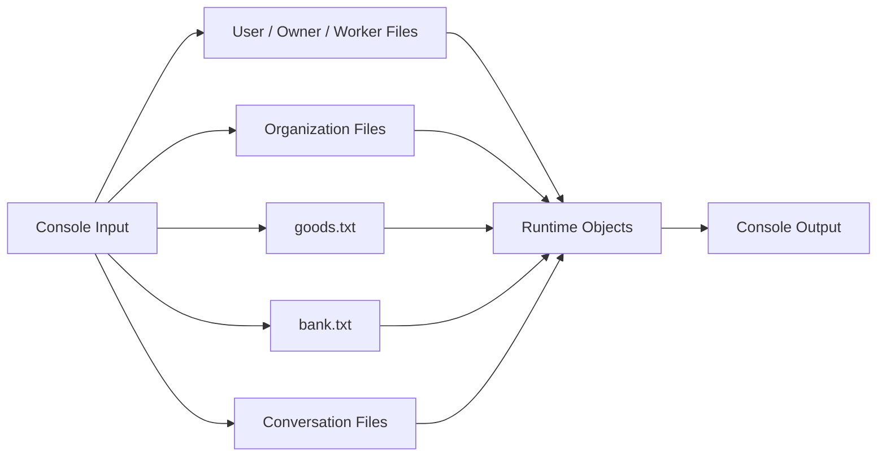

## 13. Persistence Map

| File / Directory | Purpose |
|---|---|
| `all_user_list.txt` | Global username registry |
| `owner.txt` | Owner credentials/profile/organization data |
| `worker.txt` | Worker credentials/profile/organization data |
| `user.txt` | Customer/user credentials/profile data |
| `organization.txt` | Organization-owner mapping |
| `organizations_worker.txt` | Organization-worker relationships |
| `goods.txt` | Organization products, prices and quantities |
| `bank.txt` | Simulated bank accounts and balances |
| `conversation/` | Base conversation directory |
| `client_conversation/` | Customer ↔ organization messages |
| `org_conversation/` | Organization ↔ organization messages |

## 14. Class Relationship

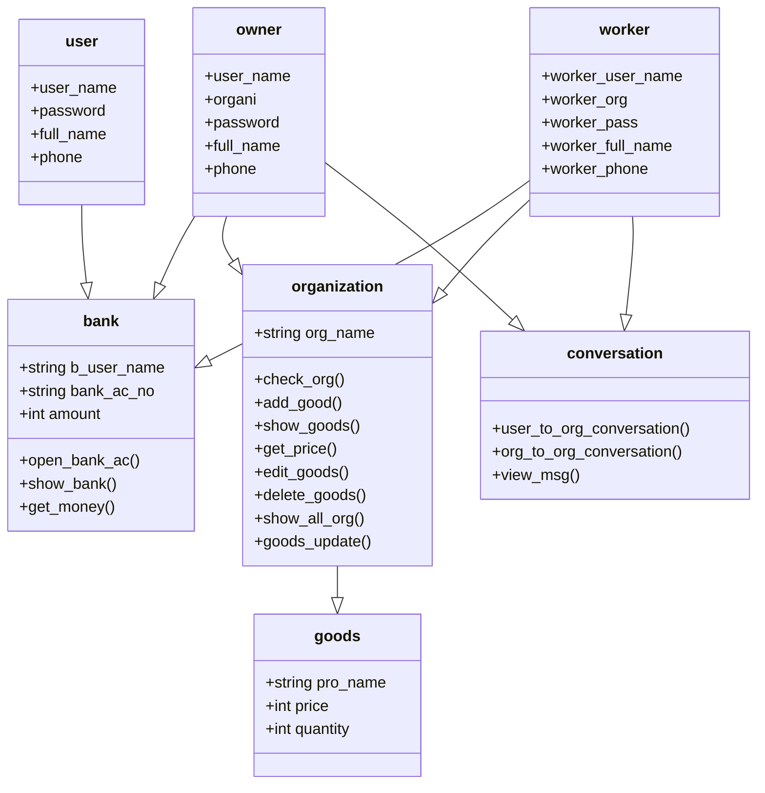

## 15. Feature Matrix

| Feature | Owner | Worker | User |
|---|:---:|:---:|:---:|
| Sign up | ✓ | ✓ | ✓ |
| Log in | ✓ | ✓ | ✓ |
| Profile | ✓ | ✓ | ✓ |
| Bank account | ✓ | ✓ | ✓ |
| View organization products | ✓ | ✓ | Via organization search |
| Add products | ✓ | — | — |
| Update products | ✓ | — | — |
| Delete products | ✓ | — | — |
| View workers | ✓ | — | — |
| Customer communication | ✓ | ✓ | ✓ |
| Organization communication | ✓ | ✓ | — |
| Search organizations | — | — | ✓ |
| Log out | ✓ | ✓ | ✓ |

## 16. Authentication Flow

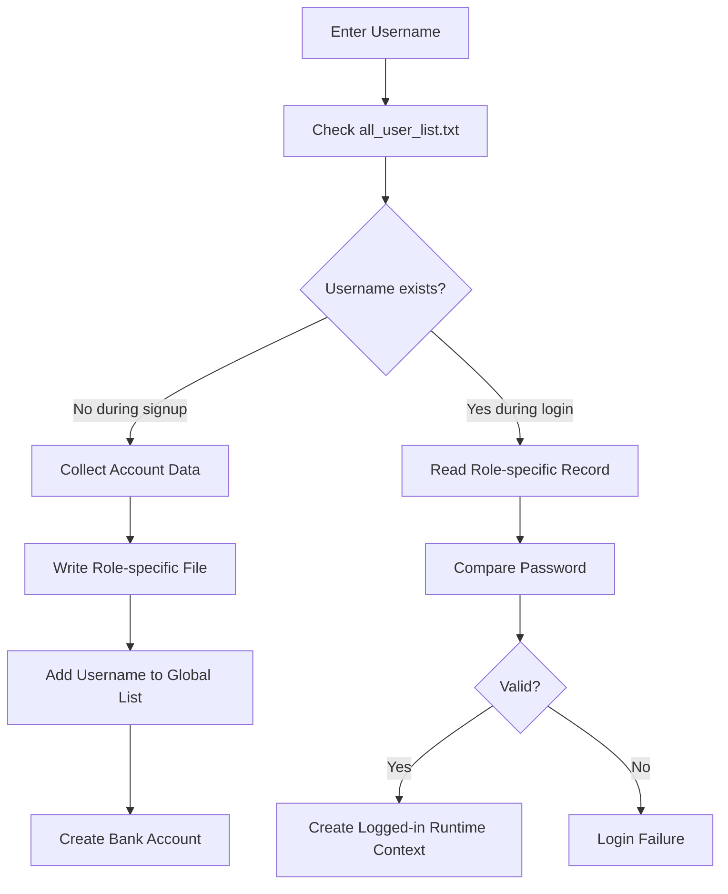

## 17. Product Transaction Concept

The customer path obtains the customer's balance and bank account before invoking organization search. The organization module exposes price/quantity lookup and product-update functions, indicating that the project contains a purchase/stock-update workflow rather than being only a static product directory.

Conceptual flow:

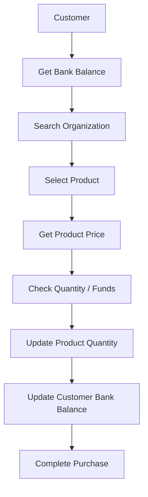

## 18. Control Flow Style

The program uses explicit menu loops and `goto` labels to return to menus.

Conceptually:

```text
Main Menu
   |
   +-- Sign Up --> Role Menu --> Registration --> Main Menu
   |
   +-- Log In --> Role Menu --> Role Dashboard --> Action --> Dashboard
   |
   +-- Exit
```

This makes the application easy to follow as a small console project, but it is not structured as a modern layered application.

## 19. Current Architecture Assessment

### Strengths

- Clear separation of major domain concepts.
- Three explicit user roles.
- Basic object-oriented modeling.
- Persistent data survives program restarts.
- Product, organization, banking and messaging concepts are connected.
- The project demonstrates inheritance, templates, STL containers, file I/O and menu-driven application design.

### Limitations / technical debt

These are observations from the current implementation, not missing requirements:

- Plain-text files are used instead of a database.
- Passwords are stored in readable text files.
- No password hashing is present.
- No authorization/session framework exists.
- File parsing is based heavily on whitespace-delimited tokens.
- Product names, names and messages cannot safely use arbitrary spaces in several data paths.
- There is no concurrent access strategy or transaction system.
- Bank behavior is only a local simulation.
- There is no network layer or real-time messaging transport.
- Error handling around file access is limited.
- The main control flow relies heavily on `goto`.
- Business logic and UI/input handling are tightly coupled.
- Several implementation details depend on relative filesystem paths and Windows-style backslashes.
- No automated test suite was identified in the repository.
- No external dependency/package management layer is evident.

## 20. Recommended Modernization Architecture

If this project were rebuilt as a production application, a more maintainable architecture would be:

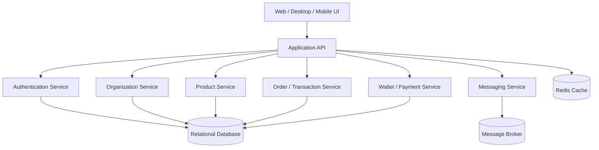

A production redesign should also introduce:

- hashed passwords
- role-based access control
- database transactions
- structured domain models
- REST/GraphQL APIs
- validation
- centralized error handling
- automated tests
- logging
- audit trails
- secure secrets management
- proper order/payment state management

## 21. Suggested Modern Data Model

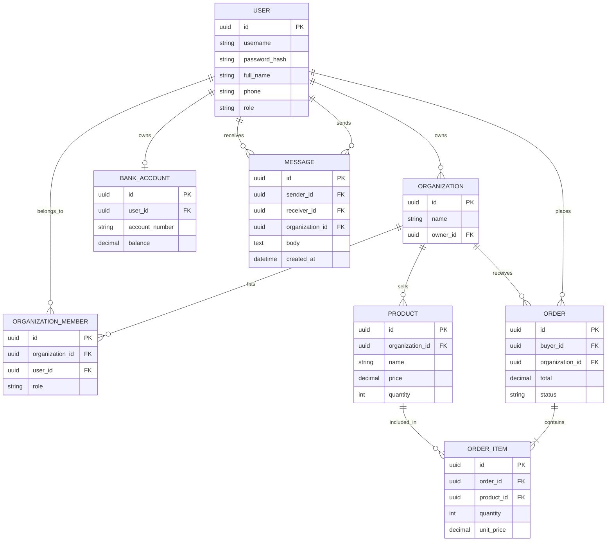

## 22. End-to-End System View

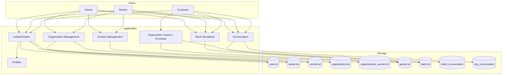

## 23. File-by-File Responsibility

### `main.cpp`
Application entry point, top-level menus, sign-up/login routing, and role-specific dashboard routing.

### `Bank.H`
Local bank-account abstraction and balance lookup/update logic.

### `Owner.H`
Owner data model, owner registration/login helpers, organization initialization, and owner-specific operations.

### `worker.h`
Worker data model, worker registration/login, organization membership and worker listing/profile behavior.

### `user.h`
Customer/user registration, login, profile and customer-side entry points.

### `organization.h`
Organization and product domain logic, including product creation, display, price lookup, update/delete and stock-related functions.

### `conversation.h`
Message storage/retrieval for customer-to-organization and organization-to-organization communication.

### Text files
Persistent storage for users, organizations, products, bank records and messages.

## 24. Documentation Status

This documentation describes the implementation that is actually present in the reviewed repository. It intentionally separates:

- **Implemented features** — visible in the source.
- **Architecture interpretation** — derived from how source modules interact.
- **Modernization recommendations** — proposed improvements, not current functionality.

## 25. Source

Primary source reviewed:

https://github.com/Fizzz083/Market-Communication
