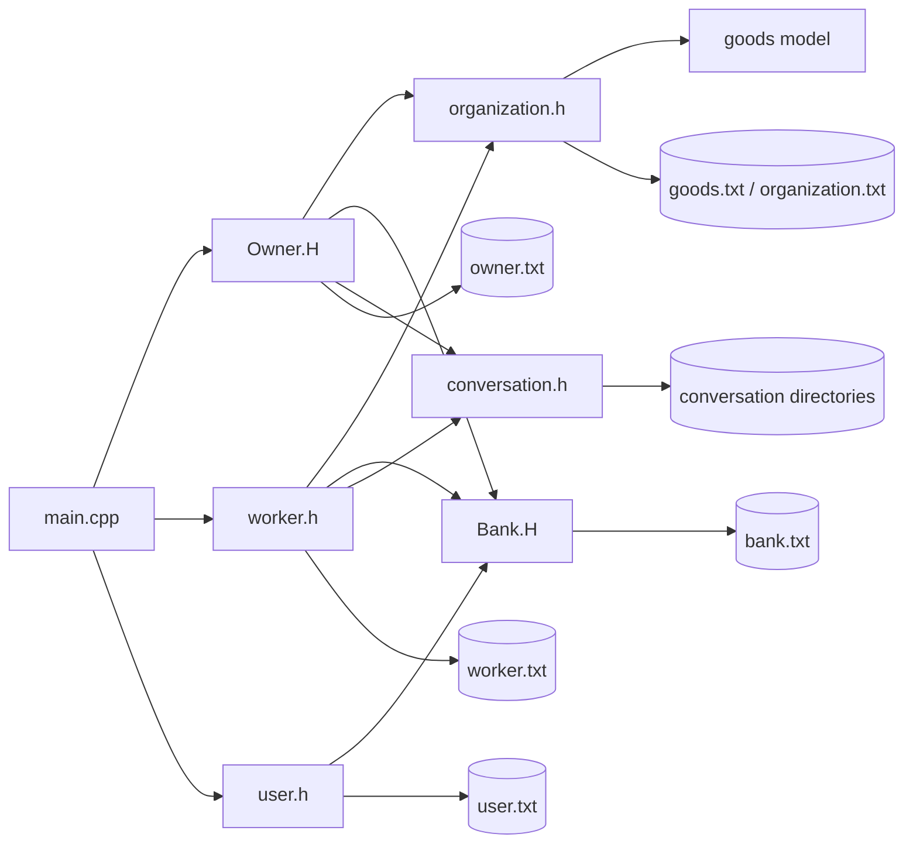

# Market Communication — Technology & Code Architecture

## Technology Stack

```text
Language
└── C++

Standard Library
├── iostream
├── fstream
├── string
├── vector
├── map
├── stringstream
└── other STL facilities through bits/stdc++.h

Application
└── Console / Terminal

Persistence
└── Local text files

Project tooling
└── Code::Blocks project artifacts
```

## Architectural Style

The project combines:

- Object-oriented programming
- Procedural menu handling
- File-based persistence
- Direct console input/output
- Domain classes
- Free helper functions
- Inheritance
- Templates
- STL containers

## Dependency Flow



## Persistence Strategy

Records are represented as whitespace-separated text.

Example:

```text
new <username> <password> <name> <phone>
```

Products:

```text
new <organization> <product> <price> <quantity> ...
```

Bank:

```text
new <username> <account_number> <amount>
```

## Important Implementation Pattern

A recurring pattern is:

```text
Open file
   ↓
Read token / line
   ↓
Parse using stringstream
   ↓
Load into vector/map
   ↓
Modify in memory
   ↓
Rewrite complete file
```

This is particularly visible in product and bank updates.

## Runtime Model

There is no server process.

```text
User
 ↓
Executable
 ↓
C++ Objects
 ↓
Local filesystem
```

The executable is the application, UI, business logic and persistence client at the same time.
